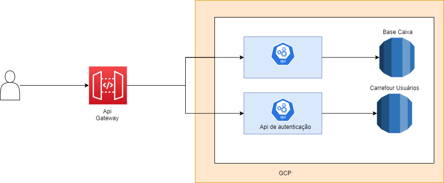
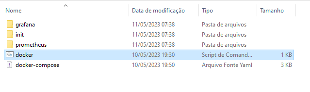
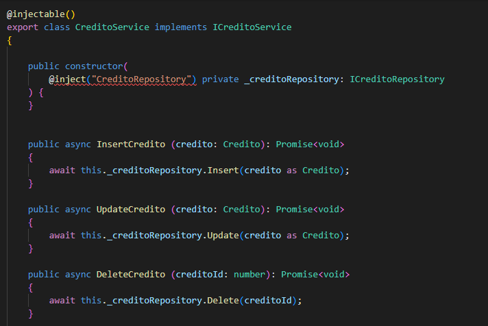
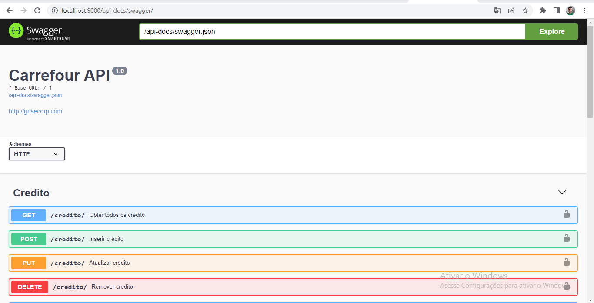
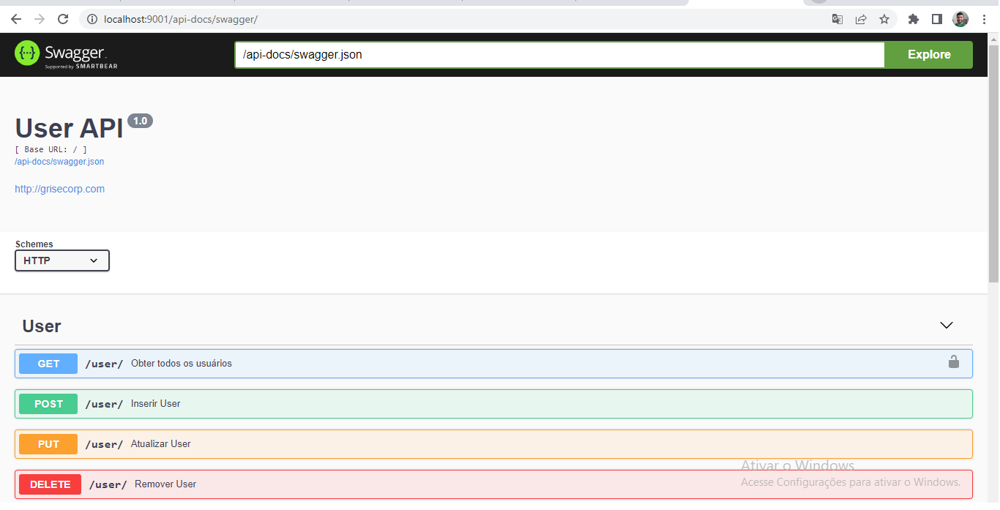

# Carrefour desafio
## Fluxo de Caixa


## Tecnologias

- Node js
- TypeORM
- Jest
- Swagger
- MySql
- Docker
- Prometheus
- Grafana

## Instalação
Para instalar todo o ambiente do sistema deve utilizar o comando dentro da pasta carrefour na pasta principal do projeto

```sh
docker-compose up 
```
Pode executar também o arquivo docker.cmd

Com todas as aplicações executando normalmente segue os acessos

| Aplicação | Host |  login | senha
| ------ | ------ | ------ | ------ 
| phpmyadmin | http://localhost:8089/index.php | root | carrefour@123
| CarrefourApi | http://localhost:9000/api-docs/swagger/ | ------ | ------
| UserApi | http://localhost:9001/api-docs/swagger/ | ------ | ------
| Grafana | http://localhost:3000 | admin | admin
| Promethus | http://localhost:9090 | ------ | ------

## Padrões de projetos utilizados

- Singleton
- Decorator
- Factory
- Repository
- Injeção de Dependência 


## Observalidade
- Foi adicionado a opção de observalidade, health check e metricas com o prometheus.
- Para visualizar acesse http://localhost:9090/targes
- Cada serviço possui um endpoint para health check, ex: http://localhost:5000/health

## Projetos
Nos projetos foi utilizado (DDD)Domain-Driven Design onde aa aplicações 
focam no dominio  refletindo as regras de negócio utilizando TypeORM deixando o 
entendimento bastante simples e conciso. Os projetos estão separados em camadas 
de domain, repository e service
- Modelo de domínio:  onde está todas as regras de negócio
- Repositórios de dados:  Onde está todas as entidades POCO (Plain Old Common-Runtime Object) e PI (Persistence Ignorance) 
- Serviços de domínio: Fornecendo os métodos necessários para realizar operações e seguir as regras de negócio

Também foi utilizado conceitos de SOLID 
- Single Responsiblity Principle (Princípio da responsabilidade única)
- Open-Closed Principle (Princípio Aberto-Fechado)
- Liskov Substitution Principle (Princípio da substituição de Liskov)
- Interface Segregation Principle (Princípio da Segregação da Interface)
- Dependency Inversion Principle (Princípio da inversão da dependência)

Como podemos ver a classe está utilizado injeção de depedência para que os módulos não 
dependem de outros, ou seja sem a necessidade de composição, também podemos ver que as classes
implementam interfaces com me´todos que realmente vão utilizar, os objetos foram utilizados 
com a intenção de serem extendidos e não modificados e as classes tem uma unica responsabilidade.

## Aplicações Swagger


   
   


